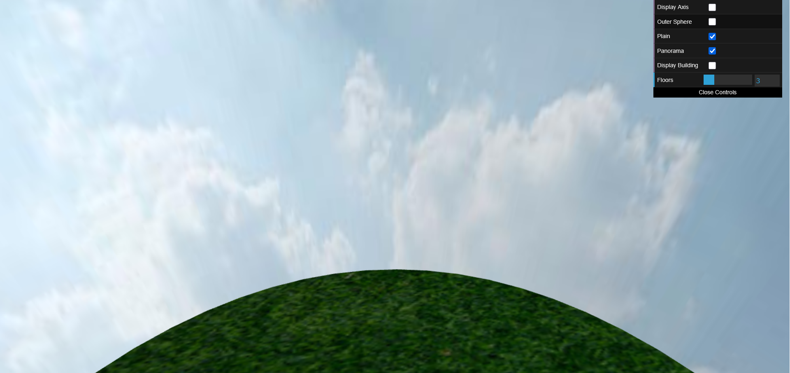
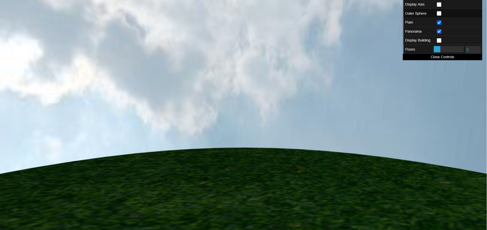
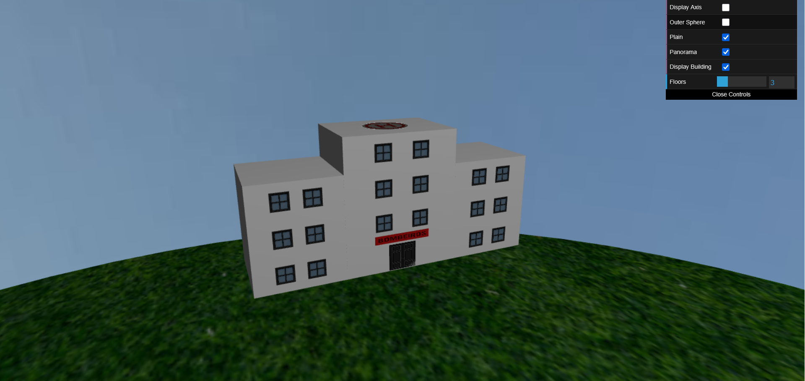
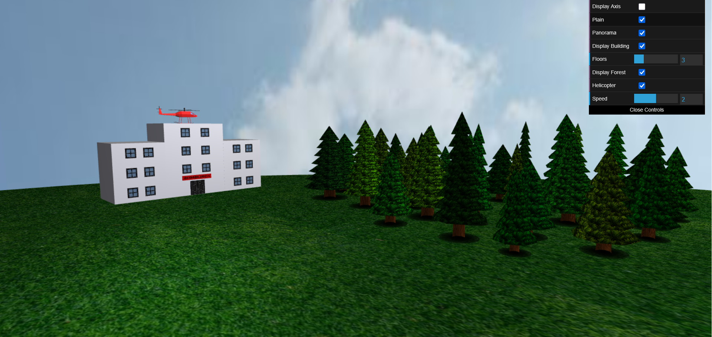
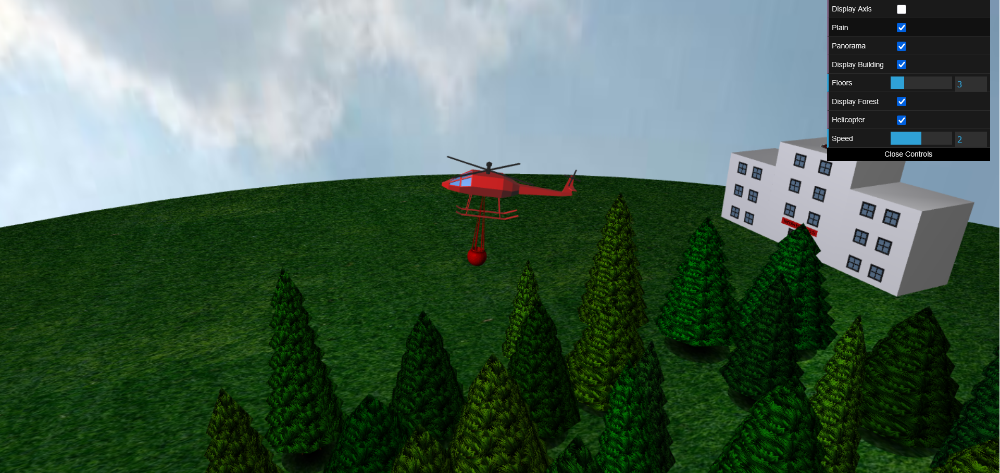
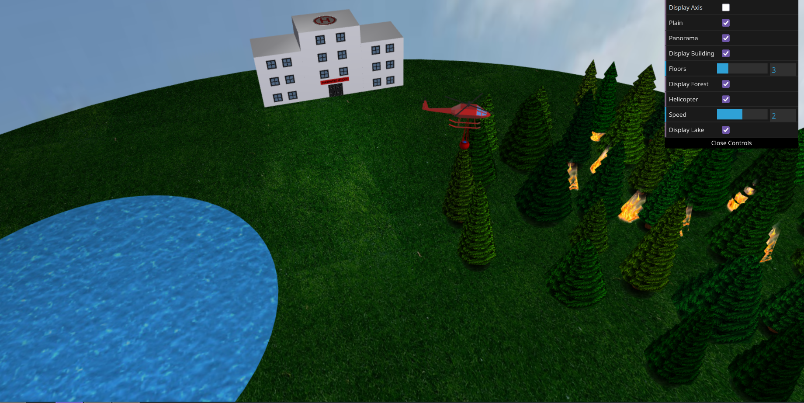
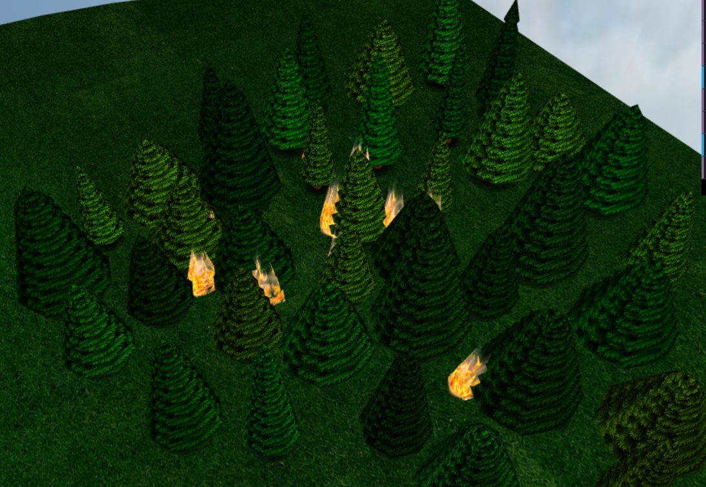
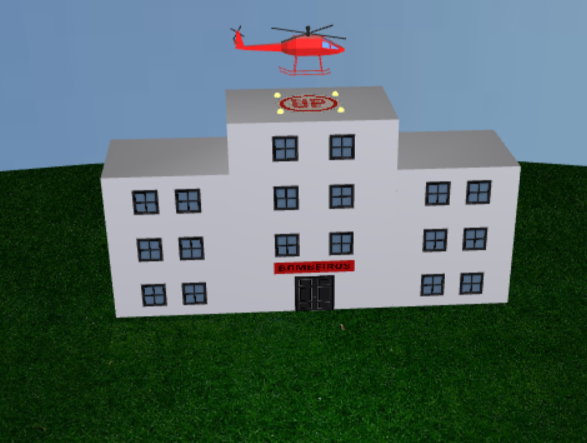

# Forest Firefighting

## Project description
**Forest Firefighting** is a 3D computer graphics simulation that visualizes an emergency firefighting scenario in a forested environment. The scene includes a **burning forest, a fire station building, a lake, and a helicopter** that performs water drops to extinguish the flames.

The goal of the project is to demonstrate real-time graphics rendering, basic physical interactions, and animation within a dynamic, interactive environment. The simulation showcases how natural resources (like water) can be used in emergency operations and emphasizes coordination between terrain, structures, and aerial units.

#### Grade: 17/20

## Core elements
### Helicopter
- The helicopter can be controlled by the user.
- Its main features include taking off, landing, collecting water from the lake, and dropping it over the fire.
- Controls:
    - `P` — Take off
    - `L` — Land (or collect water if over the lake)
    - `O` — Drop water (if bucket is full)
    - `W` — Move forward
    - `S` — Brake
    - `A` — Turn left
    - `D` — Turn right
    - `R` — Reset helicopter position

### Fire
- The fire is simulated with multiple animated pyramids, each with a fire texture and oscillating movements (upwards, sideways, and tilting), creating a realistic effect.
- Flames appear in strategic locations in the forest, between trees, and can be partially hidden by them, simulating forest fires.

### Lake
- The lake serves as a water source for the helicopter.
- The helicopter must be positioned over the lake to fill its water bucket.

### Interactions
- To extinguish the fire, the user must pilot the helicopter to the lake, stop, collect water, and then drop it over the burning areas.
- The fire is gradually extinguished in the areas hit by water, with visual feedback.
- The cycle can be repeated to put out all fire sources.

### Additional development
- The heliport changes from its normal form with an "H" in the middle to an "UP" or a "DOWN" depending on its actions.

### Graphical interface
- The interface was designed to look as realistic and visually appealing as possible, providing an immersive experience for the user.

> For more details, explore the project's graphical interface (GUI) and the [report](https://docs.google.com/document/d/e/2PACX-1vS1uzAAxmUxt5PvMJ2I1kwschqIaN-l-KsVdaDxgk95o2Ro0mFuEfFtkPNTrQiACPebo1UjZ3j-01SU/pub) for additional instructions.

## Screenshots of the implemented features

### 1.2 Adding panoramas

### 2. Firefighters building

### 3. Forest

### 4. Helicopter

### 5. Water and fire

### 6. Flame ripple

### 7. Additional developments

